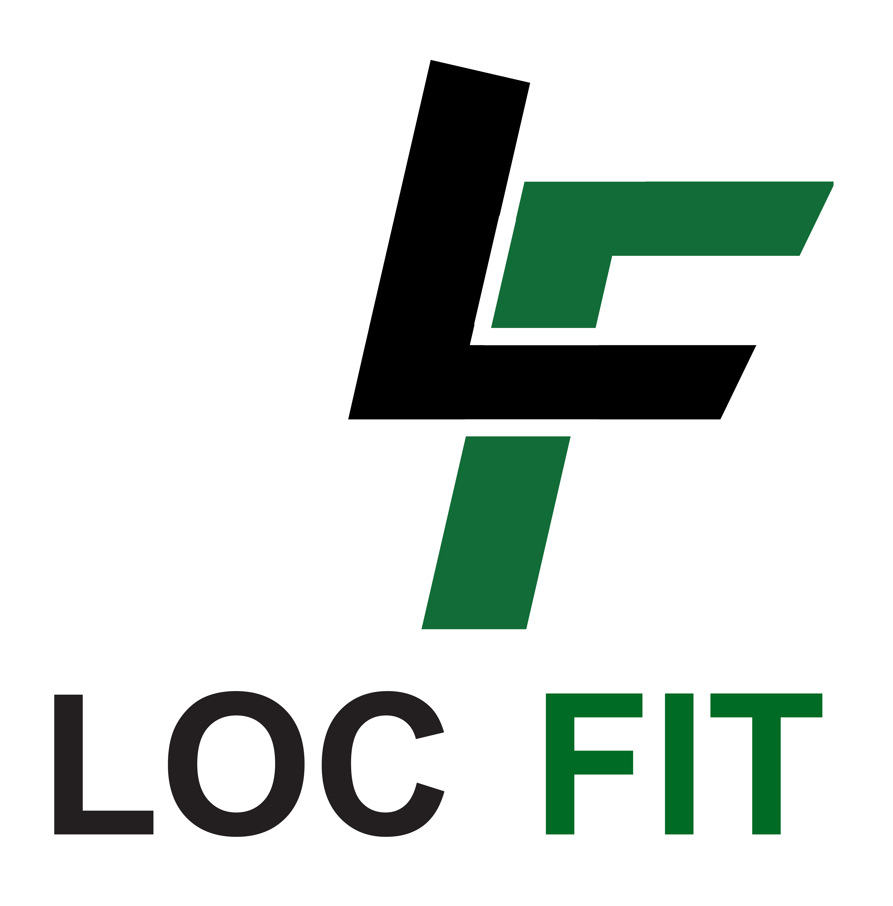

# 2024BUT2_mnavellou_mpottier_alglg
# Compte rendu SAE 3.O1 : Création du site LocFit

Notre équipe, composée de **Annaëlle Le Guénic Le Gall**, **Milo Navellou** et **Maël Pottier**, a réalisé un site de location de matériel sportif, **Locfit**, dans le cadre de la **SAE 3.O1** Développer des parcours utilisateur et intégrer des interfaces utilisateur au sein d'un système d'information.

Petit apparté, eswxrdctfgvbhujikoplm

## Description du site

Notre site internet comporte plusieurs pages permettant une navigation fluide, telles que :
- **Accueil**
- **Catalogue**
- **Détail des produits**
- **Contact**
- **Connexion** & **Inscription** si vous n'avez pas de compte. 
- **Aides**
- **Compte** : chaque personne qui se connecte aura accès à son compte et pourra le modifier ou le supprimer. Cependant, il ne peut pas le supprimer si il a une location en cours. 

Ces pages sont accessibles dès l'accès au site et sans être connecté à un compte et chaque rôle les a aussi en pages de base.

Puis chaque rôle à des pages spécifiques. 
L'agent a en plus des pages précédentes : 
- **Location(s)** : qui va permettre de voir et confirmer les locations des utilisateurs.
- **Produits** : qui va permettre d'ajouter et de supprimer un produit.

L'admin, quant à lui, a une page en plus :
- **Admin** : qui va permettre à l'admin d'inscrire et de créer un compte pour un agent sans pouvoir le supprimer par la suite.

Et pour finir le client a également une page en plus qui est : 
- **Commandes** : qui va permettre au client de voir ses commandes en cours et terminées. Il peut également annuler une location si elle n'a pas encore commencé. 

## Choix graphiques

Nous avons opté pour un design épuré avec des grandes polices d'écriture et des images imposantes, afin de correspondre aux attentes de notre cible, **Jacques Février**. Nous avons analysé notre cible afin de connaître et de savoir plus facilement ce qui serait le mieux pour lui au niveau visuel et accéssibilité. 
La couleur principale du site est le **vert foncé** (#198900), évoquant à la fois la **nature**, la **santé** et l'**espérance**, en parfaite adéquation avec notre thématique sportive.

## Fonctionnalités futures

- Actuelement, lorsqu'on arrive sur la page d'un produit, peut importe le produit il aura toujours la même description avec les mêmes dimmensions. Dans une version futur, ces dimensions seront rajoutées dans la base de donnés pour correspondre à chaque produit. 

## Problèmes recontrés 
- 1) Bug au niveau des dates : lors de l'inscription l'utilisateur rentre sa date de naissance mais elle n'était pas la même dans la page compte une fois connecté. 
- 2) L'ajout d'une image lors de l'ajout d'un produit : je n'ai pas réussi à faire en sorte d'importer une image de référence pour le produit 

## Solutions apportées
- 1) J'ai utilisé une autre fonction pour afficher les dates
- 2) Je n'ai pas trouvé de solution pour ce problème. Sans doute avec des modules mais pour les faire correspondre à nos règles BDD. 

##  Extensions et modules

Aucune extension et aucun module n'a été installé. 

## Fonctionnement

Le **client** se connecte, réserve du matérielsà des dates données. 
- Si il réserve moins de 3 jours il y a un message d'erreur.
- Si il réserve plus de 30 jours il y a un message d'erreur.

Autrement, ca envoie une demande de valdiation de commange a/aux agent(s). 

L'**agent** se connecte, va dans l'onglet "Location(s)". 
Il peut voir les commandes à valider, les commandes en cours ainsi que les commandes terminées.

En validant la commande, le statut de la commande passe de "wait" à "progress". 
La commande passe donc dans la case *Location(s) en cours*. 

Pour valider le retour de la commande il doit cocher la case et remplir la date de retour effective.

Un fois le bouton *finaliser* cliqué, cela rajoute le prix du surcout en fonction du nombre de jour de retard (+20%/jrs).

Le client verra donc apparaitre un message dans l'onglet *commandes* avec le prix du surcout à payer.